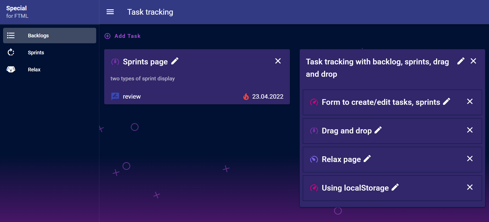
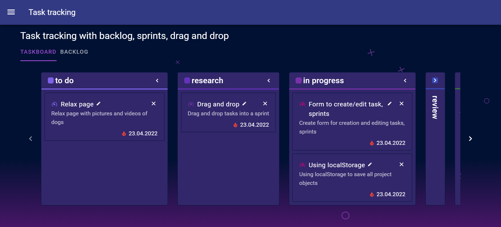
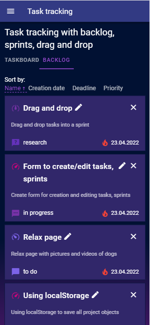
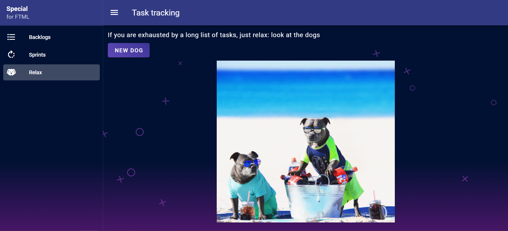

<div id="top"></div>

<!-- PROJECT LOGO -->
<br />
<div align="center">
  <h3 align="center">Task tracking</h3>
  <p align="center">
    Task tracking with backlog, sprints, drag and drop
    <br />
    <br />
    <a href="https://oleinikovapolina.github.io/task-tracking-for-FTML/dist">View Demo</a>
  </p>
</div>


<!-- TABLE OF CONTENTS -->
<details>
  <summary>Table of Contents</summary>
  <ol>
    <li><a href="#features">Features</a></li>
    <li><a href="#built-with">Built With</a></li>
    <li><a href="#project-setup">Project setup</a></li>
  </ol>
</details>

<br/>


<div class="d-flex">
  
  
</div>

<!-- FEATURES -->
<h2 id="features">✨ Features</h2>

* Create/edit tasks, sprints
* Backlog page
* Drag and drop tasks into a sprint
* Sprints page:two types of sprint display:
  * The first one is a list of all tasks filtered by priority, title, creation date, deadline
  * The second is a tabular view of all tasks by task status
* Using localStorage to save all project objects
* Relax page with pictures and videos of dogs

<p align="right">(<a href="#top">back to top</a>)</p>

<!-- BUILT WITH -->
<h2 id="built-with">🏗️ Built With</h2>

* Vue
* Vuex
* Vuex-smart-module
* Vue-router
* Vuetify
* Vue2-editor
* Vuedraggable
* Vue-moment
* Axios
* ...

<p align="right">(<a href="#top">back to top</a>)</p>

<!-- PROJECT SETUP -->
<h2 id="project-setup">⚙️ Project setup</h2>

```
npm install
```

### Compiles and hot-reloads for development
```
npm run serve
```

### Compiles and minifies for production
```
npm run build
```

### Lints and fixes files
```
npm run lint
```

### Customize configuration
See [Configuration Reference](https://cli.vuejs.org/config/).

<p align="right">(<a href="#top">back to top</a>)</p>

